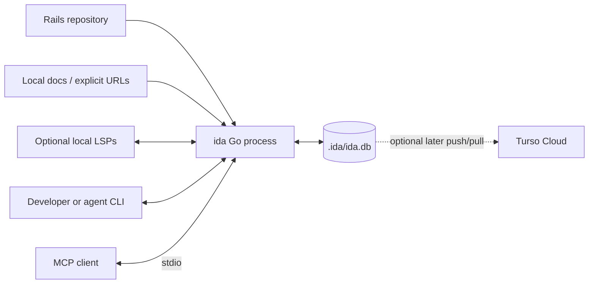
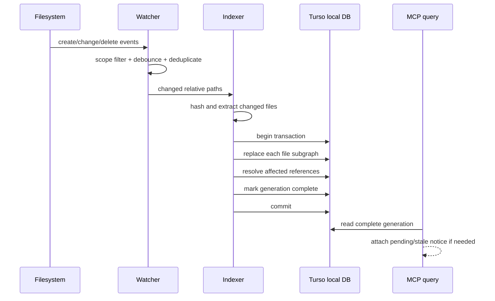

# Ida architecture

## Decisions

Ida is one Go executable with one local database per Rails worktree:
`.ida/ida.db`. The executable contains the CLI, MCP server, watcher, extractors,
resolvers, and query engine.

The local database uses Turso's Go `database/sql` driver (`tursogo`). All normal
reads and writes are local and offline-capable. Remote Turso push/pull is an
optional later feature, not part of index correctness.

This is a good boundary because a knowledge index is disposable: the repository
is the source of truth and `ida sync --rebuild` can recreate the database. The
Turso Database engine is currently beta, so releases must pin and test its
version. Ida uses ordinary tables, indexes, transactions, and parameterized SQL;
it does not depend on experimental database features.

There is no service mesh, graph database server, vector database, or mandatory
daemon. An MCP process can watch its project; a CLI user can run `ida watch`.
Concurrent processes perform idempotent, hash-guarded file updates.

The local reference projects informed three choices:

- CodeGraph's shared scope rules, debounced file updates, missed-event recovery,
  and stale-result notices are required behavior.
- Graphify's deterministic extraction plus per-edge provenance/confidence is
  retained.
- Their polyglot breadth, media ingestion, visualization, and hosted lifecycle
  are omitted so Ida can spend that complexity on Rails conventions.

## Context



## Components

Use normal Go packages with dependencies pointing inward:

```text
cmd/ida             command parsing and process lifecycle
internal/project    Rails-root discovery, config, scope, ignore rules
internal/index      full/incremental orchestration and generations
internal/extract    Ruby, templates, JS/TS, CSS, docs, schema, routes
internal/resolve    Rails, Hotwire, Stimulus, React, Tailwind relationships
internal/store      SQL migrations and queries
internal/watch      filesystem events, debounce, hash reconciliation
internal/query      search, context assembly, paths, impact
internal/lsp        optional stdio LSP client
internal/mcp        MCP schemas and stdio transport
```

Do not create interfaces for these packages until a second implementation
exists. `database/sql` is already the storage boundary.

Initial external dependencies are limited to `tursogo`, `fsnotify`, the
Tree-sitter Go runtime, and pinned language grammars. Go's JSON, HTTP, process,
hashing, path, and test packages cover the remaining foundation, including the
small MCP stdio surface.

### Project and scope

Project discovery walks upward, like Git, and refuses filesystem roots, home
directories, and their parents unless forced. It resolves paths before checking
that they stay under the project root.

The scanner shares one `Scope` predicate with the watcher. Scope combines:

1. hard safety exclusions;
2. Rails default inclusions and generated-file detection;
3. `.gitignore`;
4. `ida.json` includes and excludes.

Tests under `test/` and `spec/` are outside the default scope. They use the same
extractors and resolvers when a user opts in through `ida.json`.

The same decision and reason power `ida scope`, preventing index/watch drift.
Each worktree owns its own `.ida/` directory so platform-specific processes do
not share locks or database files.

### Extraction

Extraction is deterministic and file-oriented. An extractor receives a path and
bytes and returns plain nodes, edges, unresolved references, and diagnostics.
It never writes the database.

Use the official Tree-sitter Go binding for Ruby, JavaScript, TypeScript, TSX,
CSS, and HTML syntax. Compile the runtime and pinned grammars into each release
binary. This repeats the proven deterministic approach in both reference
projects and does not require the target repository to have Ruby, Node, or an
LSP installed. CI builds natively on each supported operating system rather
than relying on cross-compilation.

Specialized extractors handle:

- `config/routes.rb` and Rails route DSLs;
- `db/schema.rb`, `structure.sql`, and migration DSLs;
- ERB plus optional Haml/Slim when those gems are present;
- Turbo helpers and template attributes;
- Stimulus controller modules and `data-*` attributes;
- JavaScript/TypeScript modules and JSX/TSX components;
- authored CSS and Tailwind configuration;
- documentation headings, links, and code identifiers.

Tree-sitter queries provide the JavaScript/TypeScript baseline for imports,
exports, Stimulus declarations, DOM attributes, and JSX component use.
TypeScript LSP supplies precise cross-file definitions and references when
available. Unparsed syntax produces a diagnostic, never a guessed relationship.

Extractors emit stable IDs derived from project-relative path, kind, qualified
name, and source position. IDs do not use absolute paths or database row IDs.
Moving a definition may change its ID in the first release; rename tracking is
not required.

### Resolution

See [Relationship resolution](relationships.md) for the exact subset currently
implemented and its deliberate omissions.

Resolution runs after extraction. It prefers evidence in this order:

1. direct syntax/configuration;
2. unique Rails convention;
3. LSP location;
4. unique name/path match.

Multiple plausible targets produce an `ambiguous` candidate, not a normal edge.
Resolvers cover Zeitwerk file-to-constant mapping, routes, controller actions,
view lookup, partials/layouts, Active Record tables and associations, jobs,
mailers, channels, Turbo broadcasts/targets, Stimulus identifiers, React
imports/uses, and Tailwind custom tokens.

Changing a normal source file resolves that file plus its incoming unresolved
references. Changes to routes, schema, lockfiles, import maps, autoload
configuration, or `ida.json` schedule a project-wide resolution pass without
re-parsing unchanged files.

### Optional LSP enrichment

The LSP client speaks JSON-RPC over stdio and uses only standard requests such
as initialize, document symbols, definition, references, and workspace symbols.
It starts configured servers lazily, applies timeouts, caps results, and
restarts a failed server at most once per indexing operation.

Ruby LSP with its Rails add-on is the preferred Ruby enrichment because it can
surface Rails declarations and runtime-aware navigation. Runtime introspection
may boot application code, so it is opt-in and reported by `ida doctor`.
TypeScript Language Server enriches React and JavaScript resolution.

LSP data is additive. It never deletes deterministic facts, and its absence
never prevents an index.

## Storage model

The graph stays relational. Traversal needs indexed edge lookups, not a separate
graph database.

```text
projects
  id, root_fingerprint, config_hash, generation, state, indexed_at, error

files
  id, project_id, path, kind, content_hash, size, mtime, status, generation

nodes
  id, file_id, kind, name, qualified_name, start_line, end_line,
  attributes_json, generation

edges
  id, source_id, target_id, kind, confidence, file_id, start_line,
  evidence, attributes_json, generation

unresolved_refs
  id, file_id, source_id, kind, name, receiver, start_line, generation

documents
  id, source, source_type, content_hash, fetched_at, title

document_sections
  id, document_id, heading_path, body, start_line

schema_migrations
  version, applied_at
```

Required indexes cover `files(path)`, `nodes(name)`,
`nodes(qualified_name)`, `nodes(file_id)`, `edges(source_id, kind)`,
`edges(target_id, kind)`, and unresolved reference names.

Search starts with normalized exact/prefix matches across names, qualified
names, paths, node attributes, and document headings/body. A small repository
does not justify embeddings. If measured document search is poor, add one
portable lexical term table; do not adopt an experimental FTS dialect in the
first release.

Source snippets are read from the current repository after validating the path
and content hash. If the file hash differs from the indexed hash, the result is
marked pending/stale and refresh is scheduled.

## Incremental update flow



Use `fsnotify` for cross-platform change events. It watches included
directories, not individual files. A bounded periodic scan compares size,
mtime, and then content hash to recover missed events and newly created
directories. On watcher exhaustion or unsupported filesystems, Ida reports
degraded status and relies on the scan plus `ida sync`.

Small bursts use file-scoped updates. Above a configurable internal threshold,
the indexer scans and diffs the whole scope rather than trusting an incomplete
event list. Configuration is not exposed until a real repository needs tuning.

Each file replacement is a transaction:

1. verify that its content hash still matches the extracted bytes;
2. delete old edges, unresolved references, and nodes owned by the file;
3. insert the new subgraph;
4. resolve affected references;
5. update file hash/status and commit.

Full rebuilds populate a new generation. Only after all files and resolution
succeed does `projects.generation` advance. Failed or killed rebuilds leave the
previous complete generation queryable.

## Query behavior

`ida_context` is the primary agent operation:

1. tokenize the task and identify named files/symbols/framework concepts;
2. rank exact names, qualified names, paths, documentation, and nearby nodes;
3. traverse a small number of high-value Rails edges;
4. group results by file;
5. read bounded current source windows around matched symbols;
6. return excerpts, relationship summaries, confidence, and freshness.

Ranking boosts routes, definitions, production code, and direct Rails
relationships. Opted-in tests and docs remain discoverable but do not displace
the implementation unless the query names them. Generated assets never enter
the candidate set.

`impact` performs a bounded reverse traversal over calls, renders, routes,
associations, enqueues, broadcasts, imports, and test links. It says "likely
impact," includes the path that justified each result, and never claims runtime
completeness.

All operations cap node count, depth, source bytes per file, total response
bytes, and execution time. Partial results include a truncation reason.

## MCP and process model

The MCP server uses stdio. Stdout contains protocol frames only; structured logs
go to stderr. Tool handlers call the same query functions used by the CLI.

The first release does not need a shared background daemon:

- one MCP client usually owns one long-running watcher;
- extra processes can query the same local database;
- writes are short, transactional, hash-guarded, and idempotent;
- each process exposes its watcher health while database metadata exposes index
  health.

If measurements show duplicate watchers or write contention are a real problem,
add one per-project daemon with a local socket. Do not pay that lifecycle cost
before it is observed.

## Security and privacy

- Never index outside the resolved project root.
- Never index `.env`, credentials, keys, database contents, uploads, or Ida's
  own data directory by default.
- Parameterize every SQL statement.
- Validate MCP string sizes, paths, depth, limits, and result budgets.
- Treat repository files and documentation as untrusted data, never commands.
- An LSP command must come from explicit configuration or a known executable
  name; no shell interpolation.
- Remote docs require explicit user action and block localhost, link-local,
  private-network, non-HTTP(S), oversized, and redirect-to-forbidden targets.
- Cloud sync is off by default and requires credentials from the environment.
- Telemetry is absent in the first release.

## Portability and release

Build and test release artifacts for macOS, Windows, and Linux. Normalize stored
paths to slash-separated project-relative paths and convert only at filesystem
boundaries. Do not persist PIDs, sockets, absolute roots, or platform-specific
paths in graph identities.

CI must run:

- Go unit and integration tests;
- a fixture index/query test;
- create/change/delete watcher tests per operating system;
- MCP protocol smoke tests with stdout cleanliness;
- rebuild-after-interruption and database migration tests;
- release-binary `ida doctor` smoke tests.

## Reference choices

- Turso recommends `tursogo` for a local Go database with optional explicit
  push/pull sync: <https://docs.turso.tech/sdk/go/quickstart>.
- Turso Database is cross-platform but currently beta, which is why Ida treats
  the index as rebuildable and avoids experimental SQL:
  <https://github.com/tursodatabase/turso>.
- Rails' Zeitwerk conventions make file-to-constant resolution a first-class
  requirement:
  <https://guides.rubyonrails.org/autoloading_and_reloading_constants.html>.
- Ruby LSP Rails exposes associations, callbacks, validations, routes, and views
  and may use runtime introspection:
  <https://shopify.github.io/ruby-lsp/rails-add-on.html>.
- Tree-sitter maintains the Go binding used for deterministic local parsing:
  <https://github.com/tree-sitter/go-tree-sitter>.
- Turbo Streams target page changes through stream actions:
  <https://turbo.hotwired.dev/handbook/streams>.
